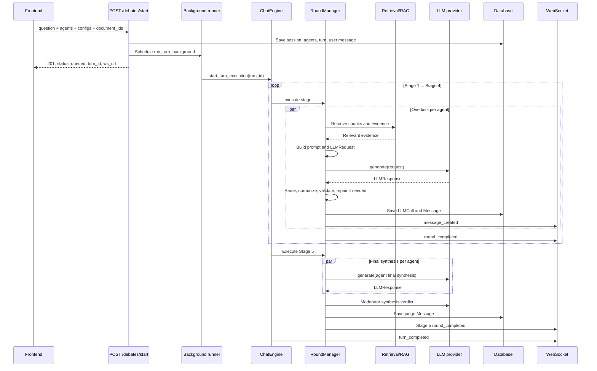

# Как AGORA вызывает LLM и формирует ответы раундов

Дата актуализации: 10 июня 2026 года

## 1. Короткий ответ

При старте дебата frontend отправляет один HTTP-запрос `POST /debates/start`. Backend
сохраняет вопрос, агентов и новый `ChatTurn`, запускает выполнение в background task и
сразу возвращает frontend статус `queued`.

Далее `ChatEngine` последовательно выполняет пять стадий:

1. Initial Positions
2. Cross-Critiques
3. Responses to Critiques
4. Revised Positions
5. Final Synthesis

Внутри каждой стадии `RoundManager` обычно запускает агентов параллельно. Для каждого
агента он:

1. собирает результаты прошлых стадий;
2. получает подходящие фрагменты документов через RAG;
3. формирует один большой текстовый prompt;
4. создаёт `LLMRequest`;
5. передаёт его через `ProviderRouter` конкретному LLM-провайдеру;
6. нормализует и проверяет ответ;
7. сохраняет `LLMCall` и `Message`;
8. отправляет результат frontend через WebSocket.

После ответов агентов в Stage 5 отдельная модель-модератор создаёт общий
`synthesis_verdict`.



## 2. С чего начинается выполнение

Frontend вызывает:

```http
POST /debates/start
```

В запросе передаются:

- вопрос пользователя;
- список агентов и их роли;
- provider, model и temperature каждого агента;
- reasoning style/depth;
- режим доступа к документам;
- назначенные агенту `document_ids`;
- режим выполнения `auto` или `manual`.

Обработчик `start_debate()`:

1. проверяет наличие агентов;
2. пропускает вопрос через Topic Guard;
3. создаёт или переиспользует `ChatSession`;
4. сохраняет `ChatAgent` и связи с документами;
5. определяет язык ответа;
6. создаёт `ChatTurn` со статусом `queued`;
7. сохраняет исходный вопрос как `Message` с `sequence_no=0`;
8. делает commit;
9. планирует `run_turn_background()`;
10. сразу возвращает `turn_id` и WebSocket URL.

Таким образом, HTTP-запрос не ждёт окончания дебата. Все LLM-вызовы происходят после
ответа API в отдельной DB-сессии background runner.

Основной код:

- `server/app/api/routes/debate.py` — `start_debate()`;
- `server/app/services/execution_runner.py` — `run_turn_background()`;
- `server/app/services/chat_engine.py` — `ChatEngine.start_turn_execution()`.

## 3. Как раунды передают контекст друг другу

`ChatEngine` выполняет стадии строго последовательно:

```python
r1 = await round_manager.execute_round_1(ctx)
r2 = await round_manager.execute_round_2(ctx, r1)
r3 = await round_manager.execute_round_critique_response(ctx, ..., r1, r2)
r4 = await round_manager.execute_round_revised_position(ctx, ..., r1, r2, r3)
r5 = await round_manager.execute_round_final(ctx, r1, r2, r4)
```

Результат одного агента представлен объектом `AgentRoundResult`:

```python
AgentRoundResult(
    agent_id=...,
    role=...,
    content=...,       # сохранённая нормализованная JSON-строка
    structured=...,    # нормализованный dict
    generation_status="success" | "failed",
    error=...,
)
```

Следующая стадия получает не всю историю чата в формате `assistant/user`, а выбранные
и сжатые поля из `structured` предыдущих результатов. Это уменьшает prompt и делает
связи между стадиями явными.

### Stage 1: Initial Positions

Каждый агент получает:

- свою роль и persona;
- исходный вопрос;
- reasoning style/depth;
- RAG evidence, если оно доступно;
- правила качества;
- JSON-схему ожидаемого ответа.

Агент должен сформировать независимую исходную позицию, аргументы, допущения,
слабость позиции и условия, при которых он изменит мнение.

### Stage 2: Cross-Critiques

Для каждого агента выбирается конкретная цель по круговой схеме:

```text
Agent[i] critiques Agent[(i + 1) % N]
```

В prompt входят собственная позиция агента и сжатая позиция целевого агента из
Stage 1. Ответ должен назвать атакуемое утверждение, скрытое допущение, сценарий
провала и последствие.

### Stage 3: Responses to Critiques

Агент получает:

- свою исходную позицию;
- критики, направленные именно против него;
- требование явно принять или отклонить каждый существенный пункт;
- требование описать план будущего изменения позиции.

### Stage 4: Revised Positions

Агент получает:

- исходную позицию;
- полученные критики;
- собственный ответ на критики;
- требование показать, что изменилось или почему позиция не изменилась.

### Stage 5: Final Synthesis

Для агентов строится компактный debate digest с исходными позициями, критиками и,
главное, пересмотренными позициями Stage 4. Каждый агент создаёт свой финальный
вывод.

После этого отдельный moderator LLM получает успешные финальные синтезы агентов и
формирует единый пользовательский `synthesis_verdict`.

## 4. Как формируется prompt одного агента

Для каждого раунда существует отдельный builder:

| Стадия | Builder |
|---|---|
| Stage 1 | `build_opening_statement_prompt()` |
| Stage 2 | `build_critique_prompt()` |
| Stage 3 | `build_critique_response_prompt()` |
| Stage 4 | `build_revised_position_prompt()` |
| Stage 5 | `build_final_synthesis_prompt()` |
| Moderator | `build_synthesis_verdict_prompt()` |

Итоговый prompt обычно состоит из следующих блоков:

```text
Persona / роль агента
Исходный вопрос
Задача текущей стадии
Выбранные результаты предыдущих стадий
Reasoning style и depth
Knowledge mode
AVAILABLE EVIDENCE и правила цитирования
Ограничения качества
Требование отвечать на языке вопроса
Строгая JSON-схема ответа
```

Перед вызовом LLM `RoundManager._run_agent_task()` выполняет RAG retrieval отдельно
для агента, превращает найденные chunks в evidence packets и передаёт их builder-у.
После сборки prompt дополнительно добавляется языковой блок.

Важно: prompt является обычной строкой. В текущем provider-слое она отправляется как
одно сообщение с ролью `user`; отдельный `system` message не используется.

## 5. Фактический LLM-запрос

Внутренний контракт запроса:

```python
class LLMRequest(BaseModel):
    provider: str
    model: str
    prompt: str
    temperature: float = 0.7
    max_tokens: int | None = None
    extra: dict = {}
```

`RoundManager._call_llm()` заполняет его так:

```python
request = LLMRequest(
    provider=agent.provider,
    model=agent.model,
    prompt=prompt,
    temperature=resolve_temperature(...),
    max_tokens=_resolve_max_tokens(...),
)
```

Типичные token budgets:

| Тип стадии | `max_tokens` |
|---|---:|
| Initial | 2000 |
| Critique | 2200 |
| Critique response | 2000 |
| Revised position | 2200 |
| Final synthesis | 2500 |
| Moderator verdict | 2000 по умолчанию из настроек |

`ProviderRouter` выбирает реализацию по `request.provider` и модели. Если нужный
provider не зарегистрирован, используется default provider; если реальных ключей
нет, factory может использовать `MockProvider`.

Для OpenRouter фактический внешний вызов выглядит концептуально так:

```python
await client.chat.completions.create(
    model=request.model,
    messages=[{"role": "user", "content": request.prompt}],
    temperature=request.temperature,
    max_tokens=request.max_tokens,
)
```

OpenRouter, Groq и Gemini implementations приводят ответ провайдера к общему
контракту:

```python
class LLMResponse(BaseModel):
    content: str
    prompt_tokens: int
    completion_tokens: int
    latency_ms: int
    raw: dict
```

## 6. Параллельность вызовов

Стадии выполняются последовательно, но агенты внутри одной стадии работают
параллельно:

```text
Stage 1: Agent A || Agent B || Agent C
Stage 2: Agent A || Agent B || Agent C
...
Stage 5: Agent A || Agent B || Agent C
```

Параллельность ограничена `asyncio.Semaphore` и настройкой:

```env
LLM_MAX_CONCURRENT_AGENT_CALLS=3
```

В режиме `manual` concurrency принудительно равен `1`, а перед вызовом модель ждёт
разрешения от `StepController`.

Для обычного дебата с `N` агентами ожидаемое число основных вызовов примерно равно:

```text
5 × N агентских вызовов + 1 moderator verdict
```

Это число может быть меньше при skipped-задачах или больше из-за повторов и repair
calls.

## 7. Как обрабатывается ответ LLM

LLM должна вернуть только JSON, но backend не доверяет этому полностью.

### 7.1 Получение сырого текста

Provider возвращает `LLMResponse.content`. Если ответ пустой, основной вызов
повторяется один раз. После повторной пустоты задача агента считается failed.

### 7.2 Парсинг и нормализация

`normalize_round_output()`:

1. извлекает JSON из ответа;
2. применяет aliases старых и новых названий полей;
3. нормализует payload в контракт конкретной стадии;
4. создаёт `display_content`, `short_summary` и служебные поля;
5. сохраняет исходный текст в `raw_content`.

Если JSON не разбирается, сначала создаётся fallback payload, затем
`recover_json_with_llm()` делает дополнительный короткий LLM-вызов с просьбой
переформатировать уже существующий текст в JSON без добавления новых аргументов.

### 7.3 Quality guard

`evaluate_round_quality()` проверяет:

- утечку текста prompt, схемы или meta-инструкций;
- наличие обязательных аргументов;
- качество critique;
- качество synthesis.

При обнаружении prompt leak ответ один раз генерируется повторно с корректирующей
инструкцией и более низкой temperature.

### 7.4 Structured-output guard

`validate_structured_output()` проверяет, что payload:

- является объектом;
- не пустой;
- не является fallback после неудачного JSON parse;
- не содержит placeholder/schema fragments;
- содержит обязательные поля текущей стадии.

При ошибке выполняются:

1. strict retry той же модели с temperature не выше `0.2`;
2. JSON repair отдельной moderator-моделью;
3. если оба способа не помогли, результат помечается `failed` и не используется
   следующими стадиями как валидный аргумент.

### 7.5 Проверка языка

Backend проверяет язык отображаемого текста. Для moderator verdict при несовпадении
языка возможен дополнительный LLM-вызов, который переводит только значения JSON,
оставляя ключи неизменными.

## 8. Что сохраняется в базе

После обработки агентского ответа сохраняются две основные записи.

### `LLMCall`

Содержит telemetry основного агентского вызова:

- turn, round и agent IDs;
- provider и model;
- temperature;
- prompt/completion token counts;
- latency;
- status;
- timestamps.

Сам prompt и полный сырой provider response в `LLMCall` не сохраняются.

### `Message`

Содержит пользовательский результат:

- связь с session, turn, round и agent;
- sender/message type;
- `sequence_no`;
- `content` как JSON-строку нормализованного payload.

Внутри payload также находятся `display_content`, `raw_content`, parse metadata,
язык ответа и дополнительные поля конкретной стадии.

Moderator verdict сохраняется как отдельный `Message`:

```text
sender_type = judge
message_type = final_summary
chat_agent_id = null
payload.message_type = synthesis_verdict
payload.agent_role = moderator
```

Технический нюанс: дополнительные recovery/retry вызовы и moderator verdict проходят
через общий LLM service, но отдельные `LLMCall` записи для каждого такого вызова
сейчас не создаются. Поэтому таблица `LLMCall` не всегда показывает полное фактическое
число запросов к провайдерам.

## 9. Как ответ доходит до frontend

После commit результата агента backend отправляет WebSocket event
`message_created`, содержащий:

- `message_id`;
- `round_id`, `round_type`, `cycle_number`;
- `agent_role`, `agent_index`;
- `message_type`;
- нормализованный `content`;
- `generation_status`;
- retrieval summary и safe error, если они есть.

Основные события жизненного цикла:

```text
turn_started
round_started
agent_started
message_created
round_completed
round_failed
turn_completed
turn_partially_completed
turn_failed
```

`agent_completed` существует в общем enum событий, но текущий `RoundManager`
фактически сообщает о завершении агента через `message_created`, а отдельный
`agent_completed` event не отправляет.

Frontend подключается к:

```text
/ws/chat-turns/{turn_id}?token=...
```

и обновляет UI по событиям. После terminal event frontend может запросить
`GET /debates/{debate_id}` и получить окончательный persisted snapshot.

## 10. Ошибки и частичное завершение

- Если один агент failed, остальные агенты стадии могут успешно завершиться.
- Если failed все агенты обязательной стадии, стадия и turn завершаются ошибкой.
- Если агентские ответы Stage 5 созданы, но moderator verdict failed, turn получает
  статус `partially_completed`, потому что частичные результаты доступны.
- Ошибки провайдера классифицируются в безопасные frontend-ошибки без утечки API
  keys и внутренних traceback.
- Статусы и ошибки сохраняются в БД и отправляются через WebSocket.

## 11. Главные точки входа в коде

| Назначение | Файл |
|---|---|
| Старт дебата | `server/app/api/routes/debate.py` |
| Background execution | `server/app/services/execution_runner.py` |
| Последовательность пяти стадий | `server/app/services/chat_engine.py` |
| Раунды, prompt assembly, LLM calls, persistence | `server/app/services/debate_engine/round_manager.py` |
| Prompt builders | `server/app/services/debate_engine/prompts/` |
| Общие LLM-контракты | `server/app/schemas/contracts.py` |
| Выбор провайдера | `server/app/services/llm/providers/router.py` |
| OpenRouter-вызов | `server/app/services/llm/providers/openrouter_provider.py` |
| Нормализация ответа | `server/app/services/debate_engine/response_normalizer.py` |
| Проверки качества и структуры | `server/app/services/debate_engine/quality_guards.py` |
| JSON recovery/repair | `server/app/services/debate_engine/two_stage_structurer.py` |
| WebSocket manager | `server/app/services/ws_manager.py` |
| Frontend HTTP API | `client/src/features/debate/api/debate.api.ts` |
| Frontend WebSocket client | `client/src/features/debate/api/debate.ws.ts` |

## 12. Итоговая модель процесса

Самая полезная ментальная модель:

```text
Вопрос пользователя
  -> сохранение turn
  -> последовательность стадий
  -> на каждой стадии отдельный prompt для каждого агента
  -> параллельные LLM-вызовы
  -> JSON parse + normalize + validate + repair
  -> сохранение Message/LLMCall
  -> WebSocket update
  -> результаты становятся контекстом следующей стадии
  -> moderator verdict
  -> terminal status и финальный snapshot
```

То есть AGORA не просит одну LLM «провести весь дебат». Backend сам управляет
дебатом как workflow: разделяет его на стадии, определяет контекст каждого агента,
проверяет структуру ответов и только затем передаёт пригодные результаты дальше.
